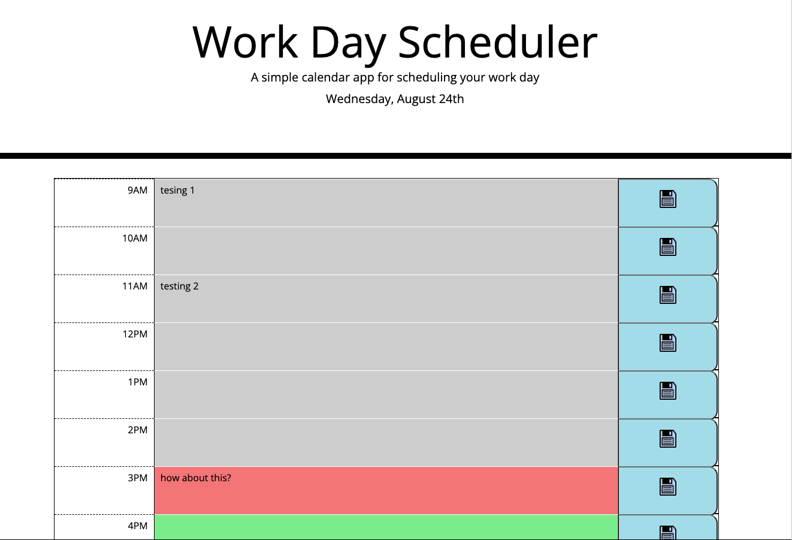

# 05-Set-up-your-today-s-schedule
Challenge No.5, Work Day Scheduler using Third-Party APIs. 

## Code written by
You, Yi Chan  (Richard) wrote the code for the html, css, and javascript. 

## Link to deployed application
https://yichanyourichard.github.io/Set-up-your-today-s-schedule/ (deployed github application)

https://github.com/YichanYouRichard/Set-up-your-today-s-schedule (github repository link)

## Screenshots


## User Story

```md
AS AN employee with a busy schedule
I WANT to add important events to a daily planner
SO THAT I can manage my time effectively
```

## Acceptance Criteria

- I am able to see current day that displayed at top of the calendar.
- I am able to see the timeblocks for that day.
- I am able to color the time block with grey for past, red for present, and green for future time block, as in challenge mock-up design
- I am able to enter a text in the description textbox each row.
- I am able to save those text into local storage by clicking Save button.
- I am able to save the text description persistently with reloading the page.


